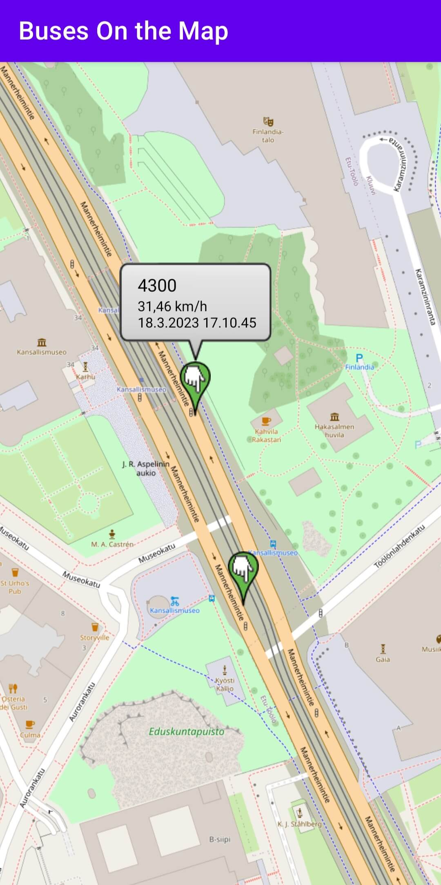

# Buses On the Map
A simple Android/Kotlin application that shows HSL MQTT bus data on a map.

The HSL (abbreviation for Helsingin Seudun Liikenne) data is retrieved in JSON format from the public [HSL High-frequency positioning MQTT API](https://digitransit.fi/en/developers/apis/4-realtime-api/vehicle-positions/) (&copy; HSL 2023) using the [MQTT Android Service](https://github.com/hannesa2/paho.mqtt.android).

The app parses the MQTT JSON payload and displays bus locations, line names, speeds and UTC timestamps in real time on an OpenStreetMap MapView. The OpenStreetMap MapView has been implemented using the [osmdroid library](https://github.com/osmdroid/osmdroid).

## Architecture

## Screenshots

